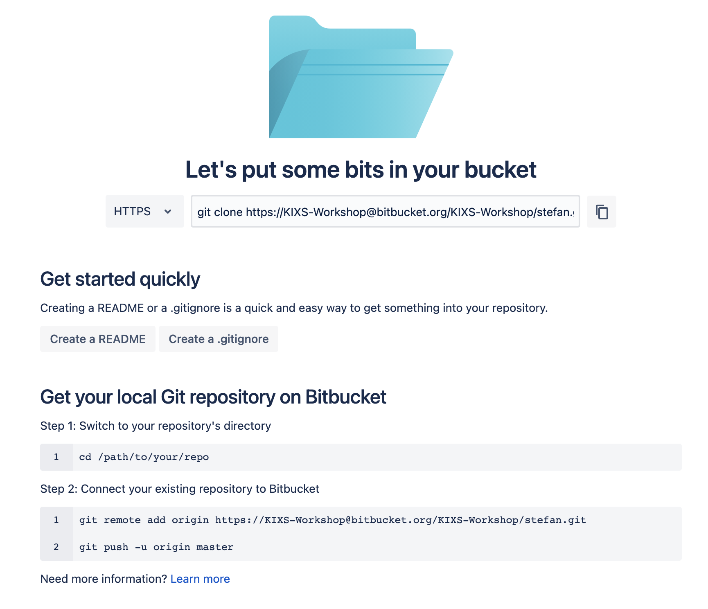

In deze opdracht gaan we aan de slag met [**Bitbucket**](https://bitbucket.org/) als gecentraliseerd platform voor onze git repository.

**Opdracht**

1) Ga naar [https://bitbucket.org](https://bitbucket.org) en log in met de gegevens die je van de trainer hebt ontvangen.

Je komt nu op de Bitbucket homepage voor deze gebruiker.

2) Ga in het menu links naar `Projects`

3) Klik het project met de naam `Workshop` aan

In Bitbucket kunnen binnen een `project` meerdere `repositories` worden aangemaakt. Tijdens deze workshop werken we allemaal in hetzelfde `project` met een eigen `repository`.

4) In de blauwe verticale balk uiterst links op het scherm kun je op het `+` icoon klikken. Kies nu voor `Create repository`.

5) Zorg dat je de volgende **afwijkende** velden invult:
* Project: `workshop`
* Repository name: `(je eigen voornaam)`
* Default branch name: `master`
* Include .gitignore: `No`

6) Maak de repo aan met `Create repository`

Als het goed is zie je nu de homepage van je **lege** repository (zie hieronder). In de volgende stap gaan we je code uploaden naar deze repository.

